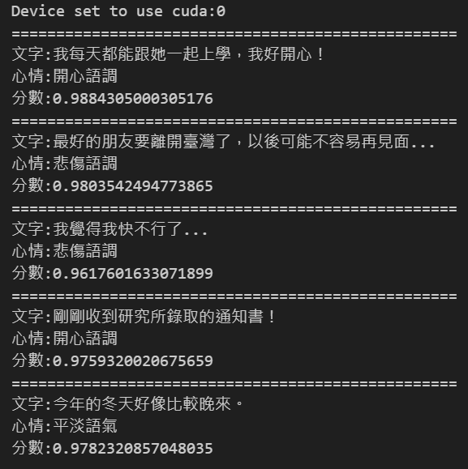
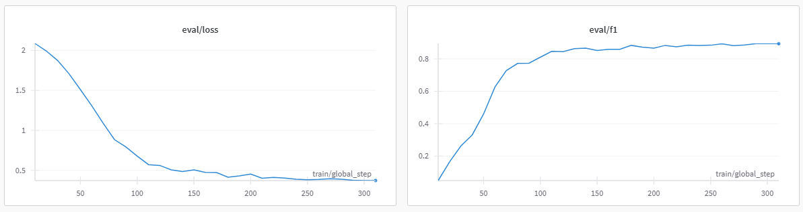

# 中文句子情緒分類

## 訓練資料來源
- [Datasets:Johnson8187/Chinese_Multi-Emotion_Dialogue_Dataset](https://huggingface.co/datasets/Johnson8187/Chinese_Multi-Emotion_Dialogue_Dataset)

## 基礎模型
- [google-bert/bert-base-chinese](https://huggingface.co/google-bert/bert-base-chinese)

## 安裝套件
- |套件名稱|版本號|
- |torch        | 2.6.0|
- |torchvision  | 0.21.0|
- |torchaudio   | 2.6.0|
- |transformers | 4.48.3|
- |datasets     | 3.2.0|
- |evaluate     | 0.4.3|
- |accelerate   | 1.3.0|
- |scikit-learn | 1.5.5|

## 說明
因檔案資料量小，有微調批次大小及降低 eval_steps
降低學習率但是變相的提高訓練次數達到訓練結果
## 成果
執行結果  

eval/loss & eval/f1

